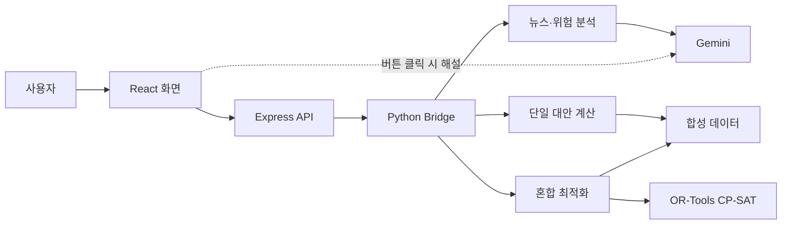

# KD 부품 물류 차질 대응 의사결정 지원

MOVE AI Challenge 2026 현대글로비스 트랙을 위한 해커톤 프로젝트입니다.

홍해·수에즈 회랑에서 해상운송 차질이 예상되거나 발생했을 때, 해외 생산공장으로 운송 중인 자동차 KD 부품의 영향을 확인하고 실행 가능한 대응안을 비교합니다. 뉴스 기반 정성 위험 분석과 비용·납기 기반 정량 계산을 분리해 제공하며, 최종 선택은 물류 담당자가 검토합니다.

> 현재 데이터는 현대글로비스 내부 데이터가 아닌 해커톤용 합성 데이터입니다. 리드타임과 비용도 대표 시나리오를 위한 결정론적 가정값입니다.

## 핵심 기능

### 1. 차질 위험 분석

- 홍해·수에즈 관련 키워드로 최근 30일 뉴스를 검색합니다.
- Google News RSS를 기본으로 사용하고, 설정된 경우 Naver News API를 우선 사용합니다.
- 검색 결과에서 여러 기사를 선택하거나 특정 기사 URL을 직접 입력할 수 있습니다.
- Gemini Structured Output으로 위험등급, 판단 근거, 불확실성, 준비 행동을 생성합니다.
- 관련성이 확인되면 출항 예정일 기준으로 우선 점검할 운송 건을 보여줍니다.

### 2. 단일 대안 비교

하나의 주문 전체에 동일한 대응안을 적용하는 Pure 전략입니다.

- 기존 계획 유지·대기
- 대체 운송계획
- 인근 공장 재고 이동
- 긴급 항공 수송

각 대안의 실행 가능 여부, 예상 도착일, 지연일수, 변동 운송비, 고정비, 지연 패널티와 총비용을 비교합니다. 지연 패널티 슬라이더를 조정하면 추천 대안이 어떻게 바뀌는지 바로 확인할 수 있습니다.

### 3. 혼합 물량 최적 배분

여러 주문의 팔레트를 복수 대안에 나누어 배정하는 Mixed 전략입니다. OR-Tools CP-SAT가 주문별 물량, 공용 운송 용량과 재고 이동 한도를 동시에 반영합니다.

두 가지 최적화 목표를 지원합니다.

- **비용·지연 종합 최소화**: 운송비, 고정비와 지연 패널티의 합을 최소화합니다.
- **납기 우선 후 비용 최소화**: 총 팔레트·일 지연을 먼저 최소화한 뒤, 동일한 지연 수준에서 운송비를 최소화합니다.

계산 결과는 대안별 물량 배분, 비용 구성, 용량 사용률과 주문별 세부 배분으로 시각화됩니다.

### 필요할 때만 생성하는 AI 해설

Pure·Mixed 계산은 Gemini를 호출하지 않는 결정론적 로직입니다. 사용자가 결과 화면의 `AI 결과 해설 생성` 버튼을 눌렀을 때만 계산 결과를 Gemini에 전달합니다. API 키가 없거나 호출에 실패하면 정해진 기본 설명을 반환합니다.

## 대표 시나리오

- 대상 회랑: 울산 KD 물류 거점 → 국내 출항항 → 홍해·수에즈 → 유럽 도착항 → 해외 생산공장
- 목적공장: 현대자동차 체코공장(`HMMC_CZ`), 기아 슬로바키아공장(`KASK_SK`)
- 대상부품: ECU, MCU, 전방 카메라 센서
- 주문: 공장별 3건, 총 6건
- 화폐: USD
- 물량 단위: 팔레트
- 지연 단위: 일 또는 팔레트·일

## 최적화 모델

주문 `o`의 물량 중 대안 `a`에 배정하는 팔레트 수를 `x[o,a]`, 공장별 대안 활성화 여부를 `y[p,a]`로 정의합니다.

비용·지연 종합 최소화 모드의 목적함수는 다음 항목의 합입니다.

```text
변동 운송비 = Σ 단위 운송비[o,a] × x[o,a]
고정비       = Σ 대안 고정비[p,a] × y[p,a]
지연 패널티 = Σ 지연일수[o,a] × 주문별 팔레트·일 패널티[o] × x[o,a]
총비용       = 변동 운송비 + 고정비 + 지연 패널티
```

주요 제약조건은 다음과 같습니다.

- 각 주문의 전체 물량을 반드시 배정
- 대체 운송계획의 전체 공용 용량 준수
- 긴급 항공의 전체 공용 용량 준수
- 공장·부품별 이동 가능한 재고량 준수
- 선택 불가능하거나 호환되지 않는 대안 배정 금지
- 대안을 사용할 때 공장별 고정비를 한 번만 반영
- 선택한 주문 수에 따라 의사결정변수를 동적으로 생성

납기 우선 모드는 1단계에서 총 팔레트·일 지연을 최소화하고, 해당 값을 제약으로 고정한 2단계에서 변동 운송비와 고정비를 최소화합니다.

## 기술 구성

| 영역 | 기술 |
|---|---|
| Frontend | React 19, TypeScript, Tailwind CSS, Vite |
| Web server | Express |
| AI | Google Gemini, Pydantic Structured Output |
| Optimization | Google OR-Tools CP-SAT |
| Python bridge | Express → Python subprocess → JSON |
| News | Google News RSS, 선택적 Naver News API |
| Test | Pytest, TypeScript compiler |



별도 데이터베이스는 사용하지 않습니다. 주문·재고·운송 대안과 설정값은 `backend/data`의 JSON 파일에서 읽습니다.

## 환경변수 설정

```dotenv
GEMINI_API_KEY="YOUR_API_KEY"
GEMINI_MODEL="gemini-3.6-flash"
APP_URL="http://localhost:3000"

# 선택 사항: 두 값을 모두 설정하면 Naver News API를 우선 사용합니다.
NAVER_CLIENT_ID=""
NAVER_CLIENT_SECRET=""
```

`GEMINI_API_KEY`는 실시간 기사·키워드 위험 분석에 필요합니다. Pure·Mixed 계산 자체는 API 키 없이도 실행할 수 있습니다.

## 주요 API

| Method | Endpoint | 역할 |
|---|---|---|
| `GET` | `/api/health` | 서버 상태 확인 |
| `GET` | `/api/data/orders` | 주문 목록 조회 |
| `GET` | `/api/data/options` | 운송 대안 조회 |
| `POST` | `/api/news/search` | 최근 30일 뉴스 검색 |
| `POST` | `/api/risk/analyze` | 기사·상황 기반 위험 분석 |
| `POST` | `/api/pure/compare` | 단일 주문 대안 비교 |
| `POST` | `/api/mixed/optimize` | 복수 주문 혼합 최적화 |
| `POST` | `/api/explain` | 계산 결과 AI 해설 생성 |

## 데이터 파일

| 파일 | 내용 |
|---|---|
| `backend/data/orders.json` | 주문, 공장, 부품, 물량, 요구 도착일과 지연 패널티 |
| `backend/data/factory_inventory.json` | 공장·부품별 현재재고와 안전재고 |
| `backend/data/options_master.json` | 대안별 리드타임, 단위비용, 고정비와 가용성 |
| `backend/data/app_config.json` | 항공·대체 운송 공용 용량과 단위 설정 |
| `backend/data/synthetic_news.json` | API 테스트·오프라인 fallback용 대표 위험 시나리오 |

`backend/app/normalization.py`가 원본 JSON을 애플리케이션 공통 모델로 변환하고, 현재재고에서 안전재고를 뺀 값을 재고 이동 가능량으로 계산합니다.

## 3분 데모 흐름

1. **차질 신호 확인**: 기본 키워드로 최근 뉴스를 검색하고 관련 기사 2~3건을 선택해 위험등급과 준비 행동을 확인합니다.
2. **단일 대안 민감도**: 대표 주문을 선택하고 지연 패널티를 조정해 추천안과 비용 구성이 바뀌는 모습을 보여줍니다.
3. **혼합 최적화**: 전체 주문을 선택해 비용 우선 배분안을 계산하고, 납기 우선 모드로 바꿔 배분·비용·지연의 차이를 비교합니다.
4. **선택적 AI 해설**: 필요한 결과에서만 해설 버튼을 눌러 추천 근거를 자연어로 확인합니다.

## 프로젝트 구조

```text
.
├─ backend/
│  ├─ app/
│  │  ├─ bridge.py              # Express와 Python 서비스 연결
│  │  ├─ risk_service.py        # 기사 기반 위험 분석
│  │  ├─ news_searcher.py       # 최근 뉴스 검색
│  │  ├─ pure_service.py        # 단일 대안 비교
│  │  ├─ mixed_service.py       # OR-Tools 혼합 최적화
│  │  ├─ explanation_service.py # 버튼형 AI 결과 해설
│  │  └─ schemas.py             # Pydantic 요청·응답 모델
│  ├─ data/                     # 합성 주문·재고·대안 데이터
│  └─ tests/                    # 계산 정책과 제약조건 테스트
├─ src/
│  ├─ components/               # 위험 분석·Pure·Mixed 화면
│  ├─ api/client.ts             # 프런트엔드 API 클라이언트
│  └─ types.ts                  # TypeScript 모델
├─ server.ts                    # Express API 및 Vite 서버
└─ requirements.txt
```

## 현재 범위와 한계

- 홍해·수에즈 회랑 하나에 초점을 맞춘 대표 시나리오입니다.
- 비용과 리드타임은 확률분포가 아닌 고정값으로 계산합니다.
- 실제 운항 스케줄, 선복, 계약 운임과 사내 승인 절차는 연동하지 않습니다.
- 뉴스 검색과 기사 URL 분석에는 외부 네트워크가 필요하며, 기사 제공처에 따라 본문 추출이 제한될 수 있습니다.
- 기사 원문을 별도 DB에 저장하지 않으며, 선택된 공개 기사와 검색 결과를 분석 입력으로 사용합니다.
- AI 위험 분석과 해설은 의사결정을 지원하며 자동으로 운송계획을 변경하지 않습니다.
